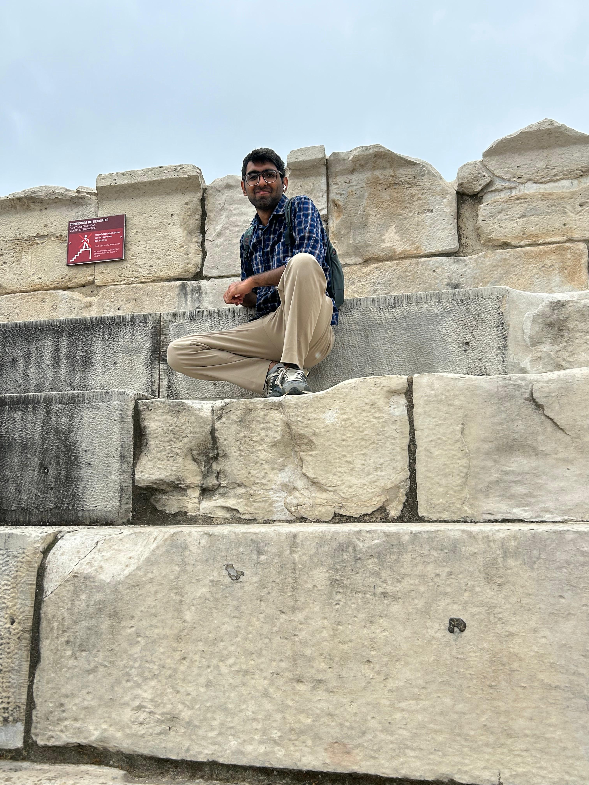

::: {.home}

::: {.hero}
{.portrait fig-alt="Portrait of Aabhas Gulati"}

::: {.hero-text}
# Aabhas Gulati

PhD student in the [TIQTOQS](https://quantum-information-open-quantum-system.pages.math.cnrs.fr/) team, Toulouse.

Supervised by [Ion Nechita](https://ion.nechita.net/) and [Clement Pellegrini](https://ion.nechita.net/).

[Research](research.qmd){.pill} [Talks](talks.qmd){.pill} [Musings](blog.qmd){.pill}

[CV](AabhasGulati_CV.pdf){.pill target="_blank"} [Google Scholar](https://scholar.google.com/citations?user=rLWFe7gAAAAJ&hl=en){.pill target="_blank"}
:::
:::

## About

I work on quantum information theory. My thesis lies at the intersection of

- Entanglement
- Symmetry in quantum states
- Polynomial optimization

More broadly, I am interested in:

- Entanglement theory: bound entanglement, Schmidt numbers, resource theory of entanglement
- Problems involving tensors and graphs

## Recent

**Preprint:** [Optimal entanglement criteria from trace invariants](https://arxiv.org/abs/2609.29471), with Bivas Mallick and Ion Nechita.

Using convex duality, we find the best entanglement criteria that can be built from finitely many trace invariants of a state, the quantities accessible through randomized measurements.

**Paper:** [Entanglement in the Dicke subspace](https://arxiv.org/abs/2602.15800), with Ion Nechita and Clement Pellegrini, in Quantum 10, 2150 (2026).

We connect the entanglement properties of mixtures of Dicke states to convex cones of completely positive and copositive tensors and their relaxations. 

:::
